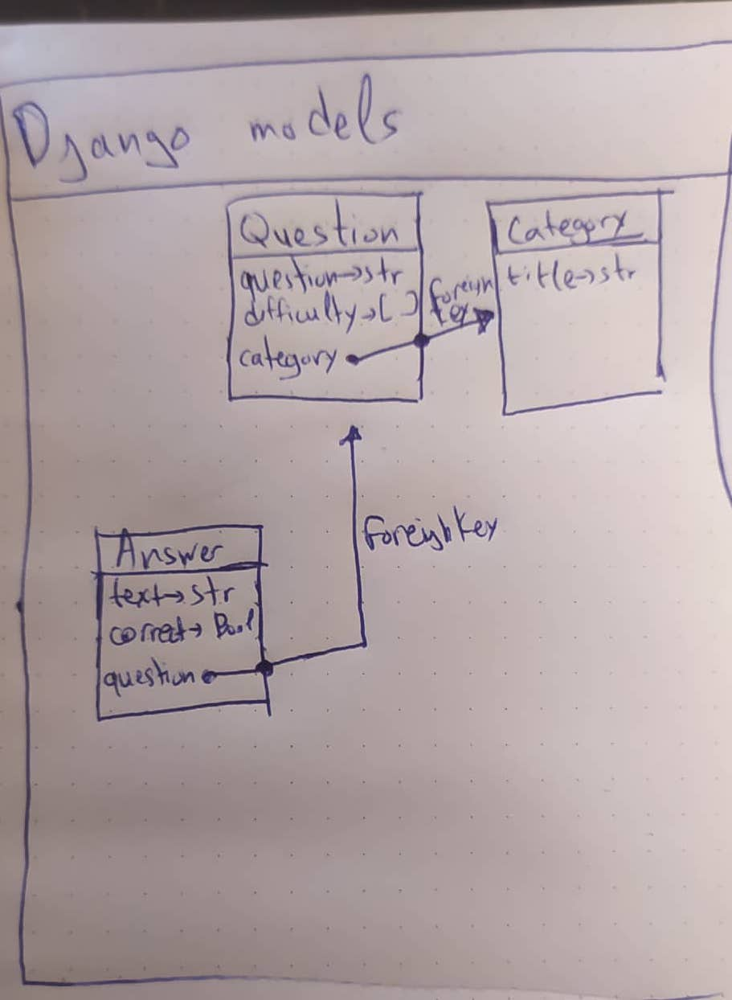

# Trivia Question Web App

## Information
This web app is a consumer of [trivia api](https://the-trivia-api.com/) in which a User should
be able to select a question, submit an answer and get the results back.

### Tech Stack & Architecture
This web app is a django web app, that uses many of django functionalities. 
It renders a question list with ajax call to the api but uses internal template view to render a single question.

## Model Representation


### Folder Structure and info
    | indev/                : Root application folder
    | -- answers/           : Answers app. It holds the answer model.
    | -- categories/        : Categories app. It holds the categories model.
    | -- indev/             : Main app. It holds ALL url mapping.
    | -- settings/          : Django settings module. 
    | -- static/            : My static assets (js/css)
    | -- static_files/      : Folder to be populated with the results of "python manage.py collectstatic"
    | -- templates/         : My templates (HTML)
    | -- tests/             : Basic Unit Testing
    | -- .gitignore
    | -- .env.dev           : Enviroment variables for dev environment
    | -- .env.prod          : Enviroment variables for production environment
    | -- docker-compose.yaml
    | -- Dockerfile
    | -- requirements.txt   : Python libraries required
    | -- prestart.sh        : Prestart script used for docker
    | -- fill_db.py         : Python script to insert data gotten from trivia-api to db

### Database
In development environment we use sqlite3 but in production we use postgres.

## Development

### Requirements
1. Python3.10
2. Virtual-env

### Instructions
1. ```shell
    cp .env.dev .env
    ```
2. ```shell
    python manage.py makemigrations
    ```
3. ```shell
    python manage.py migrate
    ```
4. ```shell
    python fill_db.py
    ```
5. ```shell
    python manage.py runserver
    ```

## Production

### Requirements
1. Docker
2. Docker-compose (v1)

### Instructions
1. ```shell
    cp .env.prod .env
    ```
2. ```shell
    docker-compose up -d --build
    ```
   
## Testing

Some unit tests (with django default unitest) have been written in order to test the api endpoints, some model functionalities and some templates

Run:
```shell
sh run_tests.sh
```

This will print a report on the console with the coverage.


